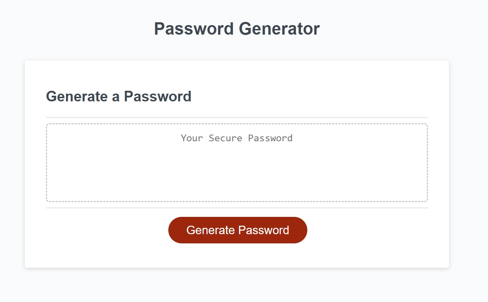

# Password Generator (JavaScript)

## Description

This website generates a random password based on user's selection. The password must follow certain rules.

The password must be within 8 to 128 charactors.

The password can contain numbers, special characters, uppercase and lowercase letters. 

The website will ask user to input again if the password length user selected is less than 7 or larger than 128. 

Screenshot of the webpage:

## 

Link to the repository: https://github.com/YC937/PasswordGenerator3

Link to the deployed website: https://yc937.github.io/PasswordGenerator3/

&copy;Copyright YM C